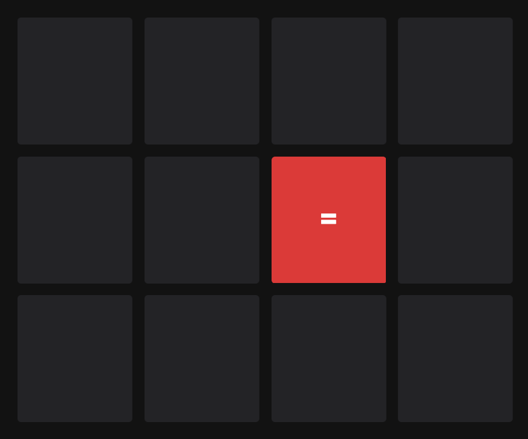

# memory-code-js

Experimento JavaScript para crear un juego simple de memoria.



## Demo

[https://zurvin.com/experiments/memory-code-js](https://zurvin.com/experiments/memory-code-js)

## Ejecutar código
Código creado usando solo javascript. Para transpilar se usa [babeljs](https://babeljs.io/).

```
/src => Código fuente javascript
/lib => Código transpilado por babel
```

```
npm i
npm run build
```

## Autor
[@yersoncp](https://github.com/yersoncp)